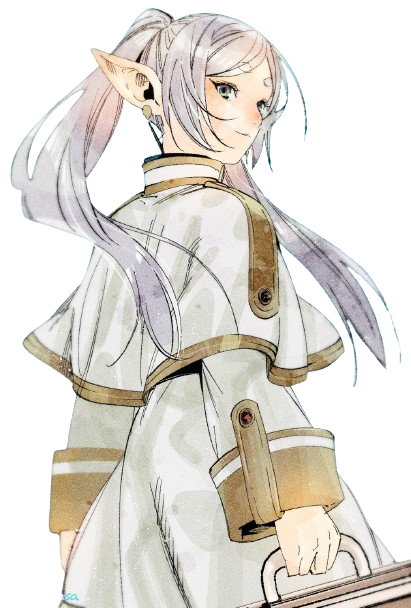

<!-- background image -->

<!-- Section : Introduction -->
## Hi 
>_Stay Hungry, Stay Foolish_  

<!-- Section : Visitors & last-commit & followers -->

## About me 📝

👋 <i>Hi there! I'm Ryan, a passionate game development newbie.</i> 🎮💻 
🌱 <i>At the moment, I'm working on creating a card game using the Godot engine.</i> 🃏🎴 
🔍 <i>Previously, I worked on object detection and model deployment projects.</i> 📦 
🚀 <i>Now, I'm excited to explore the interesting possibilities of AI in game engine development.</i> 🤖🕹️

<!-- Section : Social -->

<!-- Section : Programming -->
## Languages and Tools 🛠️

 

 

 

## Internships 💻
<i>
Sep 2021 - Feb 2022, Baidu, Deep Learning Technology Platform, Beijing China.  
Feb 2022 - Aug 2022, China Mobile Research Institute, Beijing China.  
Sep 2022 - Dec 2022, NIO, Autonomous Driving, Beijing China.
</i>

<!--  -->

## Github Stats 📊

    

## Spotify Playing 🎧

<!---
https://github.com/kittinan/spotify-github-profile
-->

    

### Steam Status 🎮

<!---
https://github.com/yuyinws/steam-card
https://cardn.yuy1n.io/
-->

    

<!-- Section : Bangumi -->

